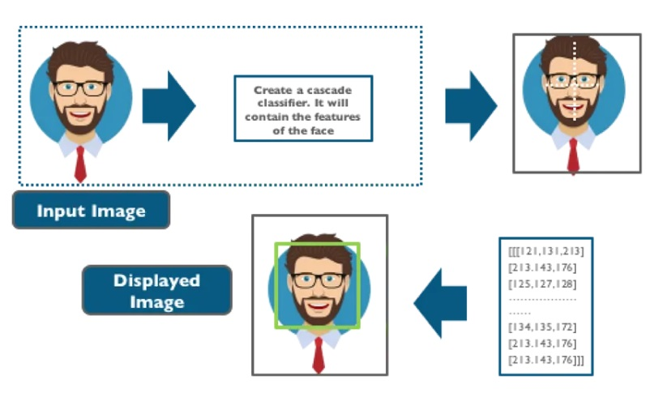

# Reconocimiento Facial

## Planteamiento

Se ha pedido optimizar el proceso de acceso a eventos mediante el desarrollo de un sistema de reconocimiento facial. El objetivo es agilizar la entrada al reemplazar la comprobación manual de entradas e identificaciones con un sistema de reconocimiento facial impulsado por inteligencia artificial. Los trabajadores podrán acercarse a un portátil, donde el sistema reconocerá sus caras y determinará si se les permite o no el paso. Para garantizar la privacidad, se busca implementar un sistema basado en machine learning que utilice una cámara para detectar en tiempo real si la persona frente al dispositivo es un empleado o no.



## Requisitos

- El sistema debe ejecutarse en un ordenador portátil.
- No se permiten servicios en la nube por cuestiones de privacidad.
- No se dispone de datos externos; los datos utilizados deben ser generados por los expertos en IA.
- Se requiere una prueba exitosa del sistema en menos de 2 segundos.

## Desarrollo

Utilizamos las bibliotecas OpenCV y face_recognition para el reconocimiento facial, se detecta mediante un bounding box, la posición de la cara e identifica, en tiempo real, si el usuario tiene acceso al evento, añadiendo el nombre de la persona.

Se mostrarán mensajes claros de "ACCESO PERMITIDO" o "ACCESO DENEGADO" debajo de cada cara reconocida.

Se incorporará un porcentaje de seguridad en el reconocimiento, visible en la pantalla junto al nombre de la persona.

Si el usuario no tiene acceso, podrá registrarse en la base de datos.

## Implementación y Uso

Para ejecutar el proyecto en un entorno local:

1. Clonar este repositorio.
2. Crear un entorno virtual.
3. Instala las dependencias necesarias.
```
pip install -r requirements.txt
```
4. Ejecuta el script principal app.py.
```
python app.py
```
